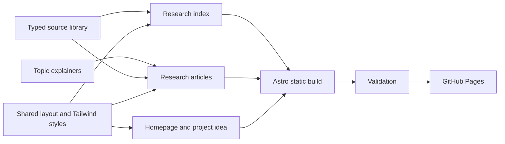

# Free the Pores

A little less product. A lot more curiosity.

**[Visit the website](https://crs48.github.io/freethepores/)**

An independent, playful exploration of simpler skin care by Christopher Smothers. Six research explainers investigate simpler bathing, skin-barrier care, and the microbiome through a searchable library of 24 studies, reviews, and guidance sources. Every source has an original link, a finding, limitations, and a reading-access note.

The editorial position is to question unnecessary products while retaining effective hygiene, sun protection, and prescribed care. The central question is whether most people could simplify their routines; this is a hypothesis to investigate, not a proven universal protocol. The site makes no claim that vegan diets eliminate odor, that baths detoxify the body, or that natural ingredients are inherently safer.

## Run locally

Requires Node.js 22.12 or newer and npm.

```sh
npm ci
npm run dev
```

Open the URL printed by Astro and append `/freethepores/`. The configured project base is intentional. Astro may choose a different port if its default is busy.

```sh
npm run validate
npm run preview
```

Validation runs Astro/TypeScript checks, library-filter tests, a production build, and an internal link/asset/citation-anchor check. The build is entirely static; there is no database or server runtime.

## Structure



| File | Purpose |
| --- | --- |
| `src/data/sources.ts` | Source metadata, findings, limitations, access notes |
| `src/data/topics.ts` | Six explainers with citations to source IDs |
| `src/data/site.ts` | Base-aware links, review date, repository URL |
| `src/data/filter.mjs` | Pure library filtering function |
| `src/pages/` | Homepage, research, project idea, practical guide, editorial standards |
| `src/styles/global.css` | Tailwind theme, typography, responsive layouts |
| `.github/workflows/deploy.yml` | Validate pull requests; deploy main to Pages |

Fonts are served locally. Search runs in the browser. Core content, source links, and expandable reading notes work without JavaScript; only the library filters require it. No analytics, external font requests, accounts, or cookies are added by the site.

## Publish with GitHub Pages

The production configuration is `site: https://crs48.github.io` with `base: /freethepores`. In the repository's **Settings → Pages**, select **GitHub Actions** as the build source. Push to `main` to validate and deploy. Pull requests validate without deployment.

For a fork, update the `site` and `base` in `astro.config.mjs`, the repository URL in `src/data/site.ts`, and the project base in `scripts/check-links.mjs`. All internal links and local assets must use the shared `href()` helper. A custom domain requires coordinated configuration changes; no domain is assumed or purchased.

## Research and corrections

This is a curated narrative collection, not a systematic review or independently clinician-reviewed advice. The launch source check is dated October 8, 2026. Read the site's [editorial standards](https://crs48.github.io/freethepores/about/) and [CONTRIBUTING.md](CONTRIBUTING.md) before adding claims. Cite the original paper where possible, distinguish abstracts from full texts, include contradictory findings, and preserve uncertainties. Do not copy journal text or figures into the repository.

Open an issue or pull request for corrections, ideally identifying the exact statement and the better evidence. A source's inclusion does not imply endorsement or permission to redistribute it.

## License and credits

MIT © 2026 Christopher Smothers for original code and writing; see [LICENSE](LICENSE). External papers are linked, not relicensed. Third-party fonts retain their SIL Open Font Licenses; see [THIRD_PARTY_NOTICES.md](THIRD_PARTY_NOTICES.md).

The fictional bath illustration was generated for this project with OpenAI image generation and optimized as WebP. It is editorial artwork, not a depiction of Christopher or a clinical illustration. Original illustration prompt and provenance are recorded in [ASSETS.md](ASSETS.md).
