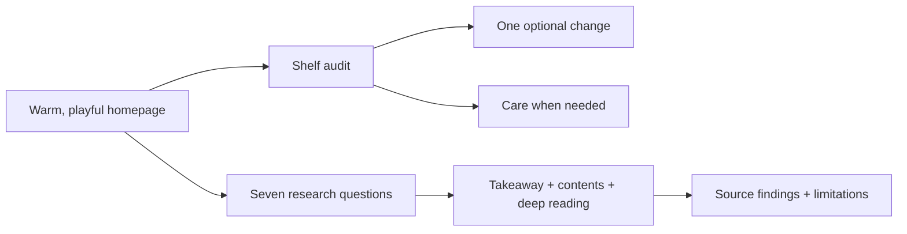

# A warmer field guide for the skin you're in

## Scope and audit

- [x] Read every page, all six topic explainers, the 24-source library, search logic, and deployment configuration.
- [x] Review the deadbutt.fyi visual benchmark: generous editorial type, warm paper, a friendly character, practical paths, and evidence close to claims.
- [x] Retain the bath illustration, yellow/lilac identity, routes, library filters, citations, no-JavaScript reading, and GitHub Pages deployment.
- [x] Identify the gaps: no explanation of pores despite the name; dense research pages without a contents list; little help applying the evidence; vague symptom escalation; library dates cannot distinguish new checks.
- [x] Refresh the shared visual system and homepage with a more expressive editorial rhythm.
- [x] Add an accessible, private shelf-audit interaction and useful no-JavaScript reading.
- [x] Extend every explainer with concrete next steps; add a pores explainer and clearer care boundaries.
- [x] Run repository validation and check the rendered HTML, routes, and interaction contracts.
- [x] Hand off for desktop/mobile browser review and publication by the coordinating agent.

## Research notes

This pass checks selected original sources and adds new practical guidance. It is not a systematic review or a claim that every source was re-reviewed. Per-source check dates preserve that distinction.

| Source | Reason for checking | Editorial decision |
| --- | --- | --- |
| [AAD: large facial pores](https://www.aad.org/public/everyday-care/skin-care-secrets/face/treat-large-pores) | Missing explanation of pores; advice differs from dry-body-skin care | Explain appearance and irritation; do not generalize targeted body washing into universal water-only face care. |
| [AAD: testing products](https://www.aad.org/public/everyday-care/skin-care-secrets/prevent-skin-problems/test-skin-care-products/) | Safe practical experimentation | Explain home testing, fragrance-free versus unscented, and distinction from clinical patch testing. |
| [AAD: rash warning signs](https://www.aad.org/public/everyday-care/itchy-skin/rash/rash-101) | Existing advice says only “seek care” | Add specific prompt-care and emergency cues; never label worsening skin a detox. |
| [AAD: acne habits](https://www.aad.org/public/diseases/acne/skin-care/habits-stop) | Avoid implying acne is dirt or too many bottles | Keep directed treatment, gentle cleansing, and time to assess; refer painful/deep acne for care. |
| [AAD: dry skin](https://www.aad.org/public/everyday-care/skin-care-basics/dry/dermatologists-tips-relieve-dry-skin) | Recheck targeted cleansing and moisturizing guidance | Preserve population-specific limits. |
| [AAD: sun protection](https://www.aad.org/public/everyday-care/sun-protection/shade-clothing-sunscreen/practice-safe-sun) | Keep effective care in the shelf audit | Retain shade, clothing, and broad-spectrum water-resistant SPF 30+. |
| [AAD: curls](https://www.aad.org/public/everyday-care/hair-scalp-care/hair/curly-hair-care) | Verify washing guidance | Preserve scalp care and the stated two-to-three-week minimum without turning it into a universal schedule. |
| [FDA: cosmetic microbial safety](https://www.fda.gov/cosmetics/potential-contaminants-cosmetics/microbiological-safety-and-cosmetics) | Practical meaning of preservation | Add clean-container and no-dilution guidance, without portraying every preservative as harmless. |
| [Bouwstra et al., 2023](https://pubmed.ncbi.nlm.nih.gov/37666282/) | Barrier schematic | Keep the barrier-lipid explanation distinct from surface oil; schematic is not clinical anatomy. |

PubMed/PMC returned incomplete/challenge pages for the bathing-frequency, diet-and-odor, and product-dynamics recheck attempts. Existing findings and original access notes are retained, without advancing their check dates or claiming a new full-text review.

## Validation and handoff

- `npm ci` using native Node 22.23.1: successful, 0 reported vulnerabilities.
- `npm run validate`: Astro check reported 0 errors, 0 warnings, 0 hints; both library-filter tests passed; all 14 pages built; all internal links, assets, and citation anchors passed.
- Additional generated-HTML checks passed: one H1 and canonical per content page, unique IDs, all four shelf-audit notes present without JavaScript, and valid control targets.
- `git diff --check`: clean. Source inspection found no storage or network APIs for user input.
- Core reading retains native `
` behavior and links; keyboard buttons expose pressed state and announce the changed result. CSS includes narrow layouts, visible focus, reduced motion, and print rules.
- Browser/viewport verification is reserved for the coordinating agent and is not claimed by this subtask. Suggested checks: home at 390px and 1280px; shelf choice by keyboard; all source-search filters and reset; an article contents link; `/less/#when-to-get-help`; no-JavaScript home and article reading.
- No push or deployment from this subtask. Preview with `npm run preview -- --port 4333` after building.

### Coordinating review

Desktop and 390px mobile browser review passed. All four shelf choices update the relevant note; keyboard activation works. Library search narrows to one source for “pores,” combining it with Original studies reaches the empty state, and Clear filters restores 28 results. The new pores article's contents link reaches its section. Homepage and article remain within the mobile viewport. Reviewed the source diff and preserved all previous routes and the deployment configuration.
